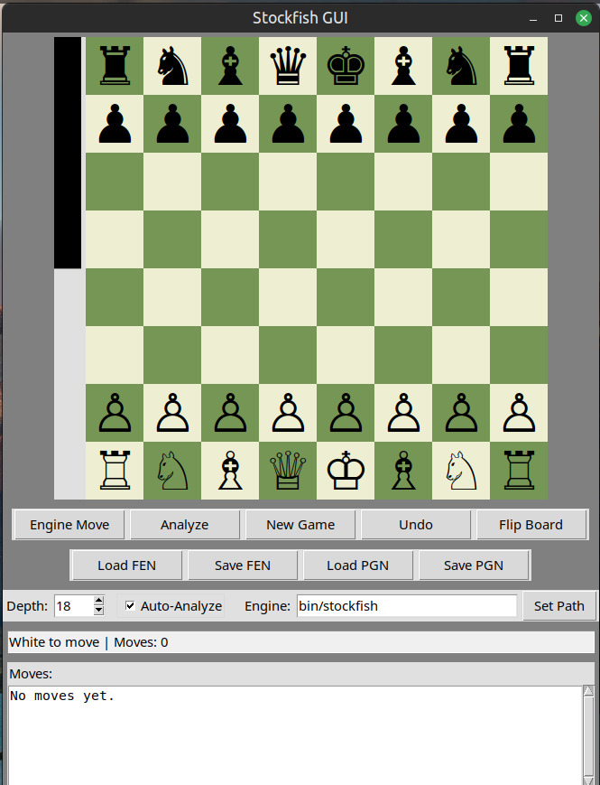

# Stockfish Chess engine

This is a chess engine built using python and c++.

> **Status:** Working — feature-complete for core functionality. Implementing serializing engine access with a lock (or single worker queue) planned.

---

## Images

### Chess Engine


## Quick Start (Linux/Windows)

* I prefer using a virtual environment, adjust to your preferences.

### Clone the repo recursively
```bash
git clone --recurse-submodules https://github.com/OneNonly-God/ChessEngine.git
```

* Go inside the repo and continue.

### Installing python modules and configuration

```bash
python3 -m venv .venv
source .venv/bin/activate
python -m pip install --upgrade pip setuptools wheel
python -m pip install python-chess
```

## Building the binary executable

The [Stockfish](https://github.com/official-stockfish/Stockfish) should be installed. Build the executeable according to your platform and replace the pre-existing stockfish binary inisde bin if required.
(**The executeable only works for linux thats why you must build it yourself**)


### Run the app
```bash
python sf.py
```

---

### What I plan to add maybe someday

* **disabling controls while the engine is busy**
* **Hotkeys and shortcuts for certain actions**
* **Implement and fix resizeabiltiy**
---

## Troubleshooting
    WIP
---

## Contributions

If you would like to contribute.Thank you for your interest in contributing! Pull requests, feature ideas, and bug reports are encouraged.

---

## License & Credits

* This project relies on and uses:

  * [Stockfish](https://github.com/official-stockfish/Stockfish) (master branch)
---
